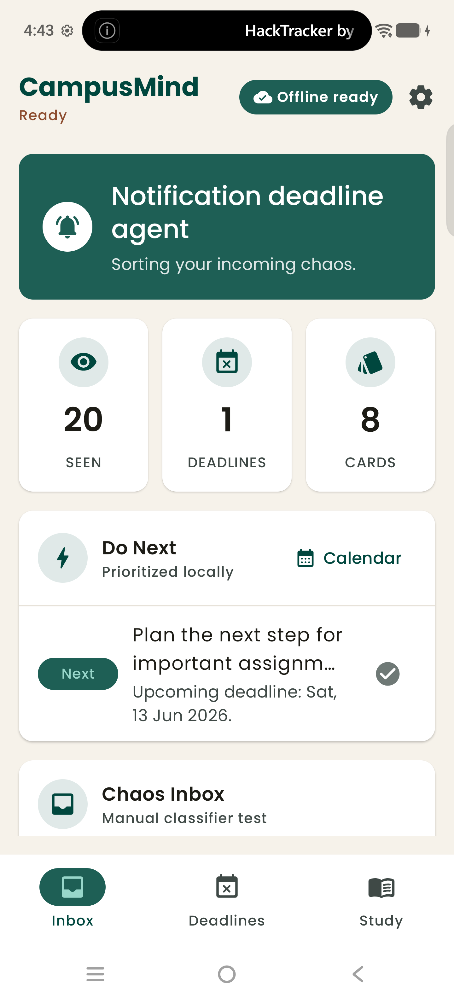
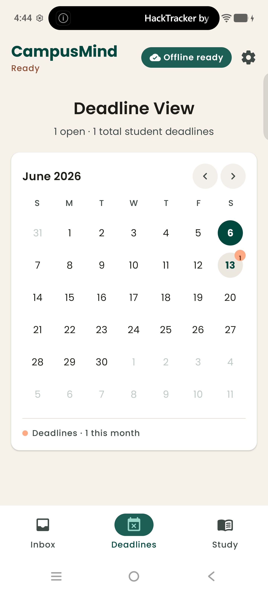
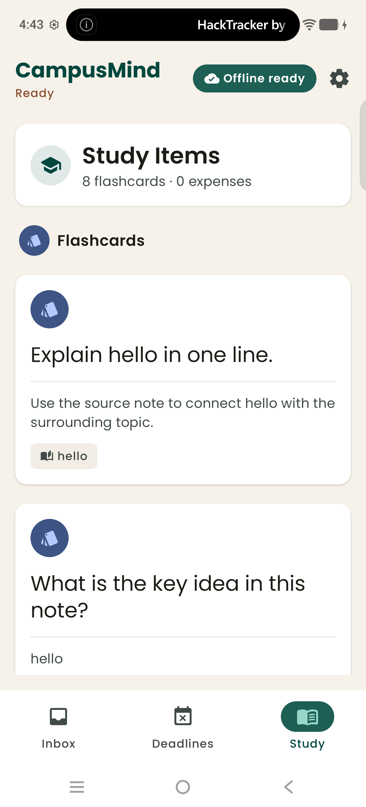
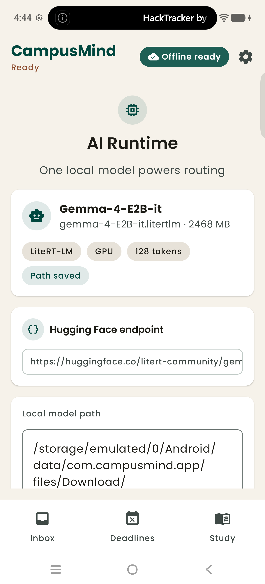

# CampusMind

CampusMind is a phone-first student productivity assistant for the AgentKit sprint. It treats the phone as the primary interface for screenshots, notes, receipts, and reminders, then routes the captured text through local student-life agents powered entirely by an on-device LLM — no cloud, no network dependency.

## Screenshots

| Inbox | Deadlines | Study | AI Runtime |
| :---: | :---: | :---: | :---: |
|  |  |  |  |
| Classify a notification and see what to do next | Detected deadlines on a calendar | Auto-extracted flashcards and expenses | Manage the on-device model |

## What it does

You paste (or dictate) a messy campus notification — an assignment brief, exam notice, fee reminder, or lecture note — and the on-device model classifies it into a **deadline**, a **flashcard**, or an **expense**, then prioritizes what to act on first.

- **Inbox** — a "Chaos Inbox" composer with voice dictation, live stats, and a locally-prioritized **Do Next** list.
- **Deadlines** — every detected due date placed on a monthly calendar, with an unscheduled list for items still missing a date.
- **Study** — auto-generated flashcards and parsed expenses grouped for quick review.
- **AI Runtime** — download, point to, and inspect the single local model that powers every agent.

## Tech

- Native Android, **Kotlin + Jetpack Compose**, Material 3.
- UI designed in Google Stitch; warm academic theme in `Poppins`.
- Local **Room** database for inbox history, tasks, flashcards, expenses, and activity logs.
- One on-device **LiteRT-LM** model: `Gemma-4-E2B-it`, running on CPU.
- Three agents (Study, Deadline, Expense) plus a notification router, with regex fallbacks when the model is unavailable.
- In-app model download from the same Hugging Face resolve endpoint shape used by Google AI Edge Gallery.

## Setup

```bash
./gradlew assembleDebug          # build the debug APK
./gradlew installDebug           # build + install on a connected device
./gradlew testDebugUnitTest      # run unit tests
```

The app does **not** bundle the model. Open **AI Runtime** (the gear icon in the top bar) and download `Gemma-4-E2B-it`; CampusMind stores the `.litertlm` file in app-specific external storage and uses that single model for all agents. You can also paste an existing model path manually.

## Hackathon Positioning

CampusMind is designed for iQOO phone-first judging: useful behavior runs entirely from the Android app and works offline, while future laptop/cloud work through iQOO Office Kit is optional polish rather than a hard dependency.
